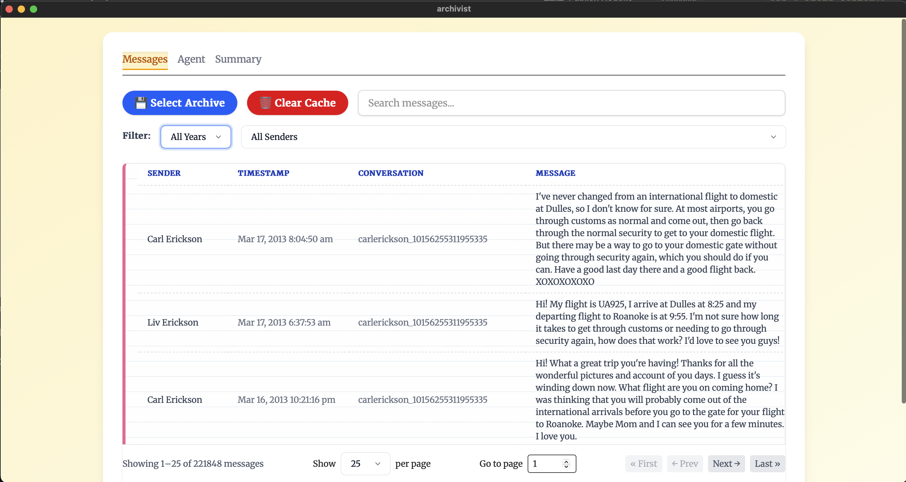
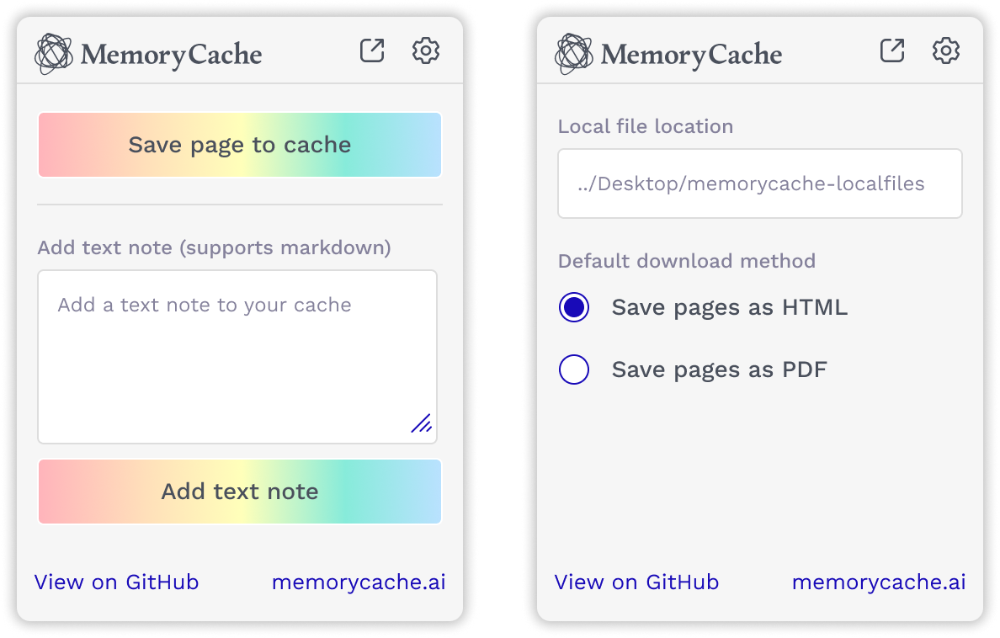

## Archivist
[Archivist](https://github.com/misslivirose/archivist) is a desktop interface for analyzing your Facebook archives. Upload a .zip folder archive from Facebook, and Archivist will display every message you've ever sent or received. You can search and filter messages, or hook up Archivist to Ollama to ask questions about your archive and generate year by year summaries.

## Memory Cache
[Memory Cache](https://memorycache.ai) was our first exploration into personal data archive. The Memory Cache Firefox Extension acts as a shortcut for archiving select articles and pages from your web browser, allowing you to create a local backup of any content you choose. With your Memory Cache archive, you can use a local AI agent to perform on-device retrieval augmented generation (RAG) queries against the pages you've saved from the web.

## Stardust
[Stardust](https://github.com/misslivirose/stardust) is a multi-user chat agent that supports message synchronization between multiple users and a chat agent. Stardust can be configured to do multi-user RAG, allowing a team to easily share context and content with local embeddings to keep data private and secure.
